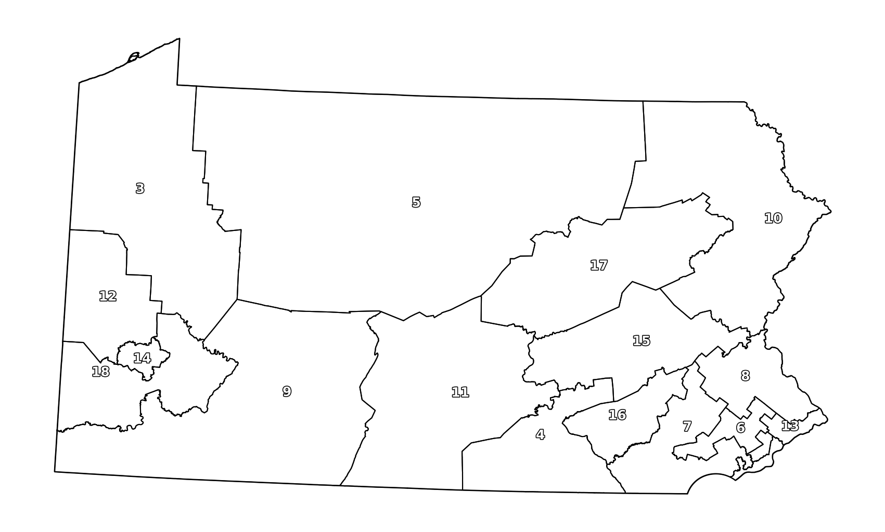
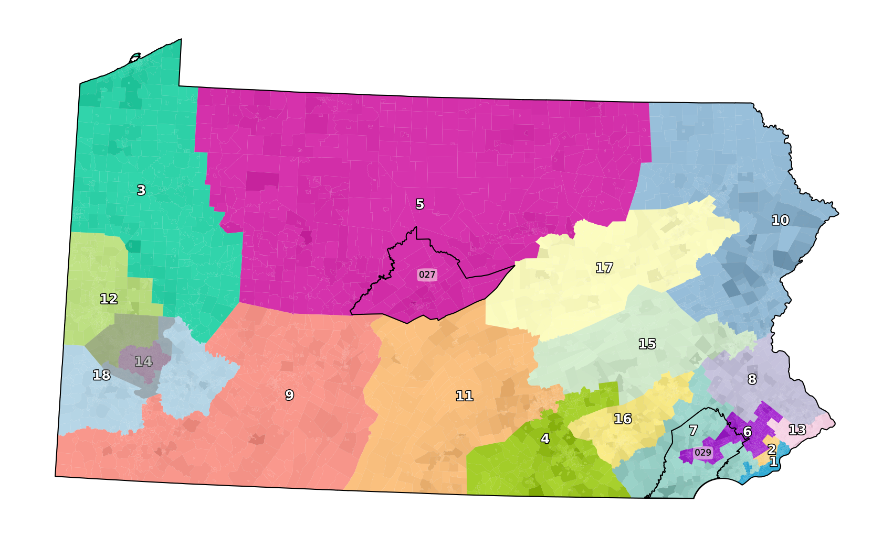
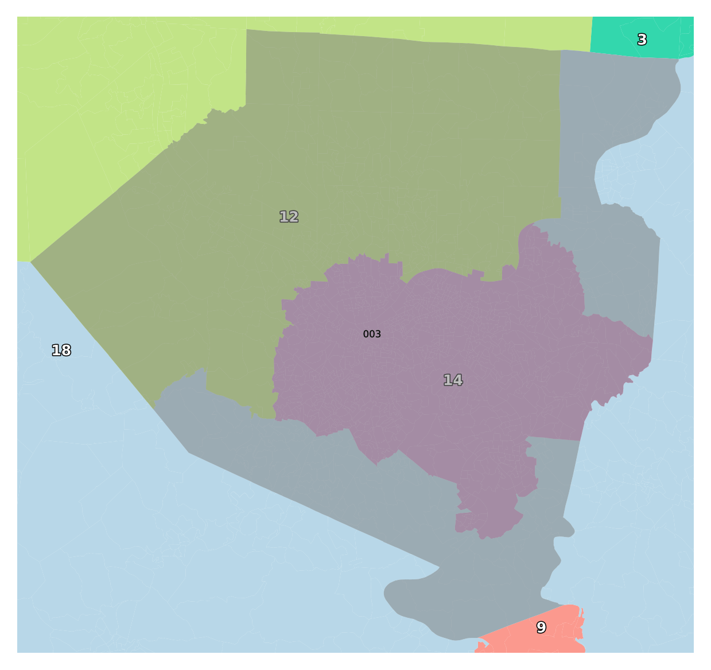
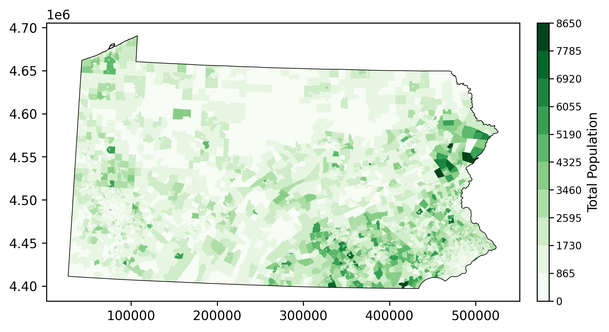
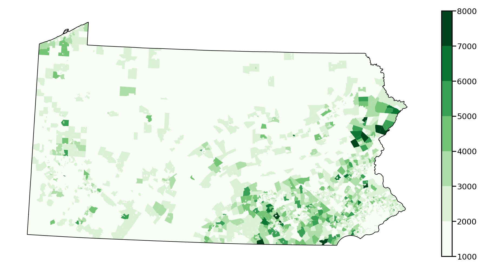
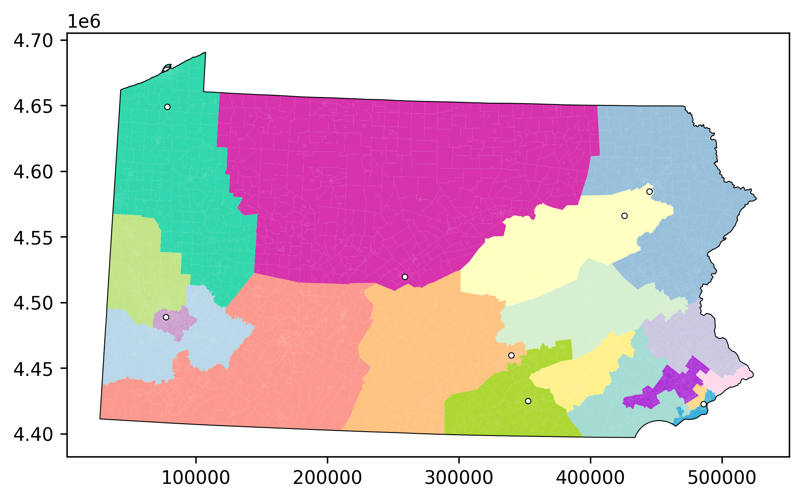
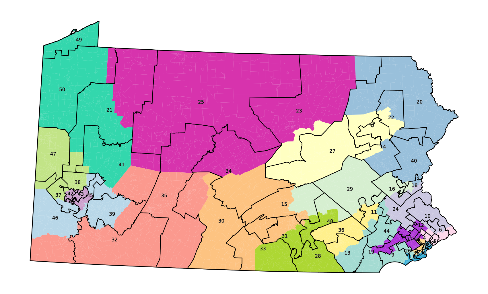
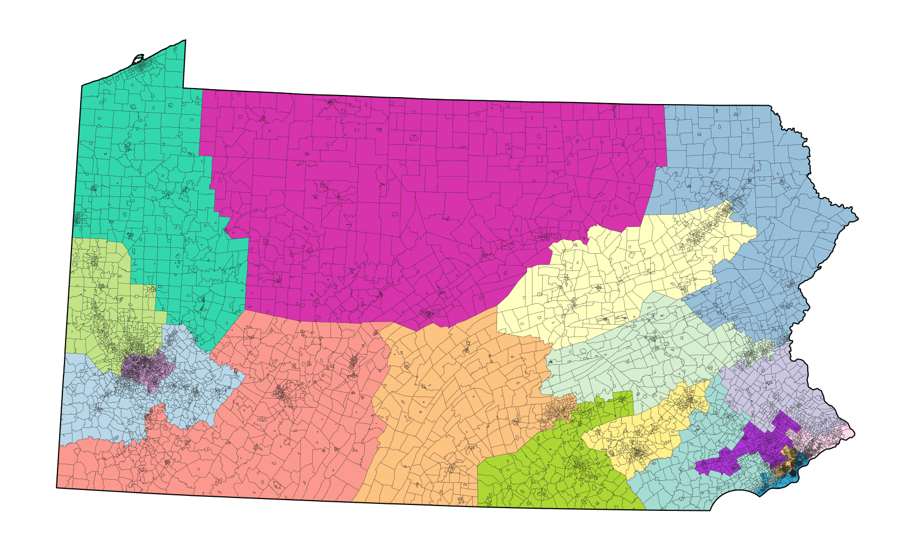

.. code:: ipython3

    import geopandas as gpd
    from gerrytools.plotting import ColoredGeoPlot, LabelFontOptions, LabelBoxOptions

.. code:: ipython3

    gdf = gpd.read_file("PA_VTD")
    gdf.columns

.. parsed-literal::

    Index(['STATEFP10', 'COUNTYFP10', 'VTDST10', 'GEOID10', 'VTDI10', 'NAME10',
           'NAMELSAD10', 'LSAD10', 'MTFCC10', 'FUNCSTAT10', 'ALAND10', 'AWATER10',
           'INTPTLAT10', 'INTPTLON10', 'TOTPOP', 'NH_WHITE', 'NH_BLACK', 'NH_AMIN',
           'NH_ASIAN', 'NH_NHPI', 'NH_OTHER', 'NH_2MORE', 'HISP', 'H_WHITE',
           'H_BLACK', 'H_AMIN', 'H_ASIAN', 'H_NHPI', 'H_OTHER', 'H_2MORE', 'VAP',
           'HVAP', 'WVAP', 'BVAP', 'AMINVAP', 'ASIANVAP', 'NHPIVAP', 'OTHERVAP',
           '2MOREVAP', 'ATG12D', 'ATG12R', 'GOV10D', 'GOV10R', 'PRES12D',
           'PRES12O', 'PRES12R', 'SEN10D', 'SEN10R', 'T16ATGD', 'T16ATGR',
           'T16PRESD', 'T16PRESOTH', 'T16PRESR', 'T16SEND', 'T16SENR', 'USS12D',
           'USS12R', 'REMEDIAL', 'GOV', 'TS', 'CD_2011', 'SEND', 'HDIST', '538DEM',
           '538GOP', '538CMPCT', 'GOV14D', 'GOV14R', 'geometry'],
          dtype='object')

.. code:: ipython3

    gp = ColoredGeoPlot(gdf)
    gp.add_districting_plan_layer(
        plancolumn="538GOP",
        colormap="none",
        dissolve=True,
        facealpha=0.8,
        edgecolor="black",
        show_labels=True,
        exclude_labels=[1,2]
    )
    
    gp.show()

.. parsed-literal::

    Rendering 1 districting plan layer...
    Rendering 1 outline layer...

.. code:: ipython3

    gp = ColoredGeoPlot(gdf)
    gp.add_choropleth_layer(
        datacolumn="TOTPOP",
        colormap="Greys"
    )
    gp.add_districting_plan_layer(
        plancolumn="538GOP",
        colormap="districtr",
        facealpha=0.8,
        show_labels=True
    )
    gp.add_outline_layer(
        geosource=gdf.loc[gdf["COUNTYFP10"].isin(["027", "029"])],
        dissolve_column="COUNTYFP10",
        show_labels=True,
        labelfont_options=LabelFontOptions(
            fontcolor="black",
            fontsize=4,
            fontweight="roman", 
            outlinecolor="grey",
            outlinewidth=0.2
        ),
        labelbox_options=LabelBoxOptions(
            facecolor="ivory",
            facealpha=0.5,
        )
    )
    gp.add_highlight_layer(
        geosource=gdf.loc[gdf["COUNTYFP10"].isin(["003"])],
    )
    
    gp.show()

.. parsed-literal::

    Rendering 1 choropleth layer...
    Rendering 1 districting plan layer...
    Rendering 2 outline layers...
    Rendering 1 highlight layer...

.. code:: ipython3

    gp = ColoredGeoPlot(gdf)
    gp.add_districting_plan_layer(
        plancolumn="538GOP",
        colormap="districtr",
        facealpha=0.8,
        show_labels=True
    )
    gp.add_outline_layer(
        geosource=gdf.loc[gdf["COUNTYFP10"].isin(["027", "029"])],
        dissolve_column="COUNTYFP10",
        show_labels=True,
    )
    gp.add_highlight_layer(
        geosource=gdf.loc[gdf["COUNTYFP10"].isin(["003"])],
        label_column="COUNTYFP10",
        show_labels=True,
    )
    gp.focus_axes(
        geosource=gdf.loc[gdf["COUNTYFP10"].isin(["003"])],
    )
    gp.show()

.. parsed-literal::

    Rendering 1 districting plan layer...
    Rendering 2 outline layers...
    Rendering 1 highlight layer...

.. code:: ipython3

    gp.get_label_positions(as_lat_long=True)

.. parsed-literal::

    Rendering 1 districting plan layer...
    Rendering 2 outline layers...
    Rendering 1 highlight layer...

.. parsed-literal::

    ('EPSG:4326',
     {'12': <POINT (-80.093 40.525)>,
      '14': <POINT (-79.911 40.402)>,
      '18': <POINT (-80.323 40.408)>,
      '3': <POINT (-79.732 40.683)>,
      '9': <POINT (-79.804 40.208)>,
      '003': <POINT (-79.998 40.436)>})

.. code:: ipython3

    gp = ColoredGeoPlot(gdf, show_axis=True)
    
    gp.add_choropleth_layer(
        datacolumn="TOTPOP",
        colormap="Greens",
        bins=10,
        show_colorbar=True,
        colorbar_label="Total Population"
    )
    gp.show()

.. parsed-literal::

    Rendering 1 choropleth layer...
    Rendering 1 outline layer...

.. code:: ipython3

    from gerrytools.plotting import ColorbarOptions
    gp = ColoredGeoPlot(gdf)
    
    gp.add_choropleth_layer(
        datacolumn="TOTPOP",
        colormap="Greens",
        # bins=[0,1000,2000,3000,4000,5000,6000,7000,8000,9000]
        bins=[1000,2000,3000,4000,5000,6000,7000,8000],
        show_colorbar=True,
        colorbar_label= "",
        colorbar_options=ColorbarOptions(
            tick_fontsize=7,
            tick_pad=1,
            label_fontsize=8,
        )
    )
    gp.show()

.. parsed-literal::

    Rendering 1 choropleth layer...
    Rendering 1 outline layer...

.. code:: ipython3

    gp = ColoredGeoPlot(gdf, show_axis=True)
    gp.add_districting_plan_layer(
        plancolumn="538GOP",
        colormap="districtr",
        facealpha=0.8,
        # show_labels=True,
    )
    pa_points = [
        (40.2727, -76.8847),
        (41.2437, -75.8891),
        (39.9538, -75.1652),
        (40.4422, -79.9854),
        (41.4089, -75.6624),
        (40.7934, -77.8600),
        (39.9606, -76.7277),
        (41.8802, -80.0851),
    ]
    gp.add_marker_layer(
        latitude_longitude_list=pa_points,
    )
    
    
    gp.show()

.. parsed-literal::

    Rendering 1 districting plan layer...
    Rendering 1 marker layer...
    Rendering 1 outline layer...

.. code:: ipython3

    gp = ColoredGeoPlot(gdf)
    gp.add_districting_plan_layer(
        plancolumn="538GOP",
        colormap="districtr",
        facealpha=0.8,
    )
    gp.add_outline_layer(
        dissolve_column="SEND",
        show_labels=True
    )
    
    gp.show()

.. parsed-literal::

    Rendering 1 districting plan layer...
    Rendering 2 outline layers...

.. code:: ipython3

    gp = ColoredGeoPlot(gdf)
    gp.add_districting_plan_layer(
        plancolumn="538GOP",
        colormap="districtr",
        facealpha=0.8,
    )
    gp.add_outline_layer(edgewidth=0.05)
    gp.show()

.. parsed-literal::

    Rendering 1 districting plan layer...
    Rendering 2 outline layers...

