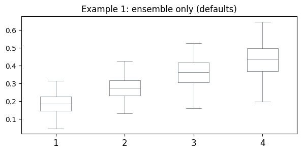
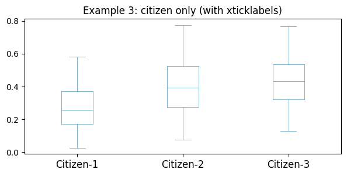
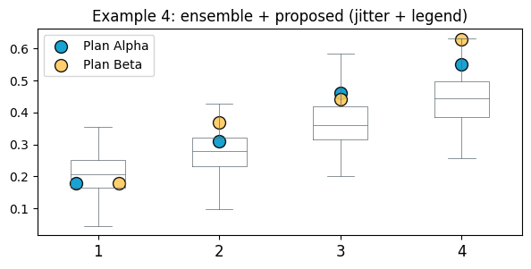
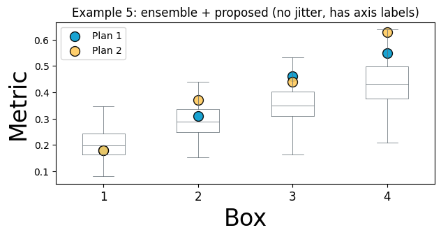
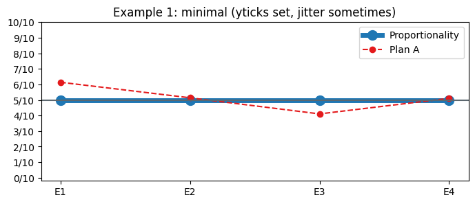
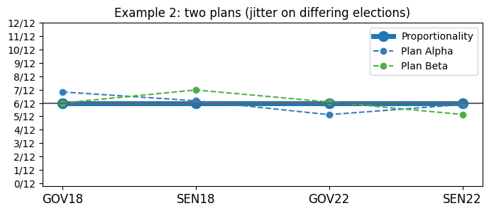
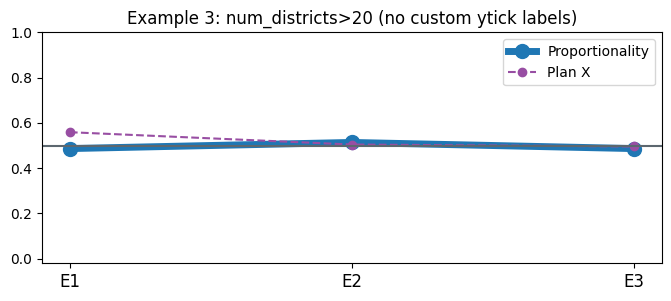
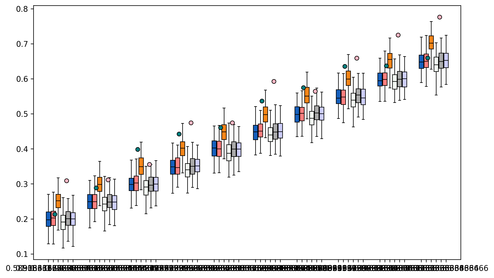

.. code:: ipython3

    from gerrytools.colors import DEFAULT_GREY, CITIZEN_BLUE, districtr

::

    ---------------------------------------------------------------------------

    ModuleNotFoundError                       Traceback (most recent call last)

    Cell In[1], line 1
    ----> 1 from gerrytools.plotting.colors import DEFAULT_GREY, CITIZEN_BLUE, districtr

    ModuleNotFoundError: No module named 'gerrytools.plotting.colors'

.. code:: ipython3

    import matplotlib.pyplot as plt
    from matplotlib.pyplot import Axes

To improve the boxplot

- ``boxplot_from_list``
- ``boxplot_from_df``

Don’t try to add the scatters -> this should be it’s own thing

Make sure to allow for setting of the z-order

Values for the legend are okay

Better way of doing all of this is with a builder pattern

GerryPlot

-> save_to (dpi must be set at beginning will assume 300)

- Allow for the parsing of latex colors
- ``add_boxplot``
- ``add_scatterplot``

.. code:: ipython3

    def boxplot(
        ax,
        scores,
        xticklabels=None,
        labels=None,
        proposed_info={},
        percentiles=(1, 99),
        rotation=0,
        ticksize=12,
        jitter=1 / 3,
    ) -> Axes:
        r"""
        Plot boxplots, which takes `scores` — a dictionary where each value
        (corresponding to an ensemble, citizens' ensemble, or proposed plans),
        will be a list of lists, where each sublist will be its own box. Proposed
        scores will be plotted as colored circles on their respective box. Color the
        boxplots conditioned on the kind of the scores (ensemble or citizen), and
        trim each sublist to only the values between the specified percentiles.
    
        Args:
            ax (Axes): `Axes` object on which the boxplots are plotted.
            scores (dict): Dictionary with keys of `ensemble`, `citizen`, `proposed`
                which map to lists of numerical scores.
            proposed_info (dict, optional): Dictionary with keys of `colors`, `names`;
                the \(i\)th color in `color` corresponds to the \(i\)th name in `names`.
            percentiles (tuple, optional): Observations outside this range of
                percentiles are ignored. Defaults to `(1, 99)`, such that observations
                between the 1st and 99th percentiles (inclusive) are included, and
                all others are ignored.
            rotation (float, optional): Tick labels are rotated `rotation` degrees
                _counterclockwise_.
            ticksize (float, optional): Font size for tick labels.
            jitter (float, optional): When there is more than one proposed plan,
                adjust its detail points by a value drawn from \(\mathcal U (-\epsilon,
                \epsilon)\) where \(\epsilon = \) `jitter`.
            labels (list, optional): x- and y-axis labels, if desired.
            xticklabels (list, optional): Labels for the boxes, default to integers.
    
        Returns:
            `Axes` object on which the violins are plotted.
        """
        # Get all the scores into one list; pick a face color.
        ensemble = scores["ensemble"] if "ensemble" in scores else scores["citizen"]
        facecolor = DEFAULT_GREY if "ensemble" in scores else CITIZEN_BLUE
    
        # Specify the boxplots' style.
        boxstyle = {
            "lw": 1 / 2,
            "color": facecolor,
        }
    
        # Plot boxplots.
        ax.boxplot(
            ensemble,
            whis=percentiles,
            boxprops=boxstyle,
            whiskerprops=boxstyle,
            capprops=boxstyle,
            medianprops=boxstyle,
            showfliers=False,
        )
    
        # Set xticks, xlabels, and x-axis limits
        if not xticklabels:
            xticklabels = range(1, len(scores["ensemble"]) + 1)
        ax.set_xticks(range(1, len(ensemble) + 1))
        ax.set_xticklabels(xticklabels, fontsize=ticksize, rotation=rotation)
        ax.set_xlim(0.5, len(ensemble) + 0.5)
    
        # Plot each proposed plan individually, adjusting its detail points by
        # a value drawn from the uniform distribution of specified width centered on
        # the index of the violin.
        if "proposed" in scores:
            for boxplot in range(len(scores["proposed"])):
                for plan, score in enumerate(scores["proposed"][boxplot]):
                    # Horizontally jitter proposed scores if there are multiple scores
                    # at the same height.
                    jitter_val = (
                        random.uniform(-jitter, jitter)
                        if scores["proposed"][boxplot].count(score) > 1
                        else 0
                    )
                    color_val = ""
                    if "colors" in scores["proposed"]:
                        color_val = scores["proposed"]["colors"][boxplot]
                    else:
                        color_val = districtr(plan + 1).pop()
                    ax.scatter(
                        boxplot + 1 + jitter_val,
                        score,
                        color=color_val,
                        edgecolor="black",
                        s=100,
                        alpha=0.9,
                        label=proposed_info["names"][plan] if boxplot == 0 else None,
                    )
            ax.legend()
    
        if labels:
            ax.set_xlabel(labels[0], fontsize=24)
            ax.set_ylabel(labels[1], fontsize=24)
    
        return ax

.. code:: ipython3

    import numpy as np
    def make_ensemble_boxes(n_boxes=4, n_per_box=200, seed=0):
        rng = np.random.default_rng(seed)
        boxes = []
        for j in range(n_boxes):
            # Different center/spread per box + a couple outliers so percentile trimming is meaningful
            x = rng.normal(loc=0.20 + 0.08*j, scale=0.06 + 0.01*j, size=n_per_box)
            x = np.clip(x, 0, 1)
            x = np.concatenate([x, [0.0, 1.0]])  # outliers
            boxes.append(x.tolist())
        return boxes
    
    def make_citizen_boxes(n_boxes=3, n_per_box=150, seed=1):
        rng = np.random.default_rng(seed)
        boxes = []
        for j in range(n_boxes):
            x = rng.beta(a=2+j, b=5, size=n_per_box)  # bounded in [0,1]
            boxes.append(x.tolist())
        return boxes
    
    # Proposed scores: a list-of-lists where each sublist corresponds to a box,
    # and each entry within is a plan's score for that box.
    def make_proposed_for_boxes(n_boxes=4):
        # 2 proposed plans across all boxes; include duplicates in box 1 to trigger jitter.
        return [
            [0.18, 0.18],  # duplicate -> jitter branch triggers
            [0.31, 0.37],
            [0.46, 0.44],
            [0.55, 0.63],
        ][:n_boxes]

.. code:: ipython3

    fig, ax = plt.subplots(figsize=(7, 3))
    scores1 = {"ensemble": make_ensemble_boxes(n_boxes=4, seed=10)}
    boxplot(ax, scores1)
    ax.set_title("Example 1: ensemble only (defaults)")
    plt.show()

.. code:: ipython3

    fig, ax = plt.subplots(figsize=(7, 3))
    scores3 = {"citizen": make_citizen_boxes(n_boxes=3, seed=12)}
    boxplot(
        ax,
        scores3,
        xticklabels=["Citizen-1", "Citizen-2", "Citizen-3"],  # needed due to bug noted below
    )
    ax.set_title("Example 3: citizen only (with xticklabels)")
    plt.show()

.. code:: ipython3

    import random
    random.seed(1)
    np.random.seed(1)
    fig, ax = plt.subplots(figsize=(7, 3))
    scores4 = {
        "ensemble": make_ensemble_boxes(n_boxes=4, seed=13),
        "proposed": make_proposed_for_boxes(n_boxes=4),
    }
    proposed_info4 = {"names": ["Plan Alpha", "Plan Beta"]}  # must exist if proposed exists
    boxplot(ax, scores4, proposed_info=proposed_info4, jitter=0.25)
    ax.set_title("Example 4: ensemble + proposed (jitter + legend)")
    plt.show()

.. code:: ipython3

    fig, ax = plt.subplots(figsize=(7, 3))
    scores5 = {
        "ensemble": make_ensemble_boxes(n_boxes=4, seed=14),
        "proposed": make_proposed_for_boxes(n_boxes=4),
    }
    proposed_info5 = {"names": ["Plan 1", "Plan 2"]}
    boxplot(ax, scores5, proposed_info=proposed_info5, labels=["Box", "Metric"], jitter=0.0)
    ax.set_title("Example 5: ensemble + proposed (no jitter, has axis labels)")
    plt.show()

.. code:: ipython3

    fig, ax = plt.subplots(figsize=(7, 3))
    scores6a = {
        "ensemble": make_ensemble_boxes(n_boxes=2, seed=15),
        "proposed": [[0.2, 0.3], [0.4, 0.5]],
    }
    try:
        boxplot(ax, scores6a)  # proposed_info defaults to {} -> KeyError on proposed_info["names"]
    except Exception as e:
        print("Example 6A expected failure:", repr(e))
    plt.close(fig)

.. parsed-literal::

    Example 6A expected failure: KeyError('names')

.. code:: ipython3

    from gerrytools.plotting.utils import sort_elections
    
    def sealevel(ax, scores, num_districts, proposed_info, ticksize=12) -> Axes:
        r"""
        Plot a sea level plot: Each plan is a line across our elections on the
        x-axis, with Democratic vote share on the y-axis. The statewide Dem. vote
        share (proportionality) is plotted as a thick blue line.
    
        Args:
            ax (Axes): `Axes` object on which the sea level plot is plotted.
            scores (dict): Dictionary with keys of each plan plus a `statewide` key
                for proportionality. Each value is another dictionary, with keys for
                each election, values are the # seats.
            proposed_info (dict, optional): Dictionary with keys of `colors`, `names`;
                the \(i\)th color in `color` corresponds to the \(i\)th name in `names`.
            ticksize (float, optional): Font size for tick labels.
        """
        assert "statewide" in scores
        elections = sort_elections(scores["statewide"].keys())
        shares_by_plan = {plan: [] for plan in scores}
        for plan in scores:
            for election in elections:
                shares_by_plan[plan].append(scores[plan][election])
    
        ax.plot(
            shares_by_plan["statewide"],
            marker="o",
            markersize=10,
            lw=5,
            label="Proportionality",
        )
    
        for i, plan in enumerate(proposed_info["names"]):
            for j in range(len(shares_by_plan[plan])):
                if len(set([shares_by_plan[plan][j] for plan in shares_by_plan.keys()])) > 1:
                    jitter = random.uniform(-0.02, 0.02)
                else:
                    0
    
                shares_by_plan[plan][j] = shares_by_plan[plan][j] + jitter
    
            ax.plot(
                shares_by_plan[plan],
                marker="o",
                linestyle="--",
                color=proposed_info["colors"][i],
                label=plan,
            )
    
        ax.legend()
    
        if num_districts <= 20:
            yticks = np.arange(0, 1 + 1 / num_districts, 1 / num_districts)
            yticklabels = [f"{i}/{num_districts}" for i in range(num_districts + 1)]
            ax.set_yticks(yticks)
            ax.set_yticklabels(yticklabels)
    
        ax.axhline(0.5, color=DEFAULT_GREY, label="50%")
        ax.set_xticks(range(len(elections)))
        ax.set_xticklabels(elections, fontsize=ticksize)
        ax.set_ylim(-0.02, 1)
    
        return ax

.. code:: ipython3

    
    # Helper: build seat-share dicts
    def seatshare_map(num_districts, **seats_by_election):
        return {k: v / num_districts for k, v in seats_by_election.items()}
    
    # -----------------------------
    # Example 1: Minimal “happy path”
    # - has "statewide" (assert passes)
    # - num_districts <= 20 -> ytick labels branch runs
    # - jitter branch triggers (values differ across plans at some elections)
    # -----------------------------
    fig, ax = plt.subplots(figsize=(8, 3))
    num_districts = 10
    
    scores1 = {
        "statewide": seatshare_map(num_districts, E1=5, E2=5, E3=5, E4=5),
        "Plan A":    seatshare_map(num_districts, E1=6, E2=5, E3=4, E4=5),
    }
    proposed_info1 = {"names": ["Plan A"], "colors": ["#e41a1c"]}
    
    random.seed(0)  # jitter reproducible
    sealevel(ax, scores1, num_districts=num_districts, proposed_info=proposed_info1, ticksize=10)
    ax.set_title("Example 1: minimal (yticks set, jitter sometimes)")
    plt.show()

.. code:: ipython3

    
    
    # -----------------------------
    # Example 2: Two proposed plans + jitter clearly visible
    # - multiple plans
    # - jitter varies by election
    # -----------------------------
    fig, ax = plt.subplots(figsize=(8, 3))
    num_districts = 12
    
    scores2 = {
        "statewide": seatshare_map(num_districts, GOV18=6, SEN18=6, GOV22=6, SEN22=6),
        "Plan Alpha": seatshare_map(num_districts, GOV18=7, SEN18=6, GOV22=5, SEN22=6),
        "Plan Beta":  seatshare_map(num_districts, GOV18=6, SEN18=7, GOV22=6, SEN22=5),
    }
    proposed_info2 = {
        "names": ["Plan Alpha", "Plan Beta"],
        "colors": ["#377eb8", "#4daf4a"],
    }
    
    random.seed(1)
    sealevel(ax, scores2, num_districts=num_districts, proposed_info=proposed_info2)
    ax.set_title("Example 2: two plans (jitter on differing elections)")
    plt.show()
    

.. code:: ipython3

    
    # -----------------------------
    # Example 3: num_districts > 20 (skips ytick relabeling branch)
    # -----------------------------
    fig, ax = plt.subplots(figsize=(8, 3))
    num_districts = 37
    
    scores3 = {
        "statewide": seatshare_map(num_districts, E1=18, E2=19, E3=18),
        "Plan X":    seatshare_map(num_districts, E1=20, E2=18, E3=19),
    }
    proposed_info3 = {"names": ["Plan X"], "colors": ["#984ea3"]}
    
    random.seed(2)
    sealevel(ax, scores3, num_districts=num_districts, proposed_info=proposed_info3)
    ax.set_title("Example 3: num_districts>20 (no custom ytick labels)")
    plt.show()

.. code:: ipython3

    
    
    # -----------------------------
    # Example 4 (EXPECTED FAILURE): missing "statewide" -> assertion error
    # -----------------------------
    fig, ax = plt.subplots()
    scores4 = {"Plan A": {"E1": 0.5}}
    try:
        sealevel(ax, scores4, num_districts=10, proposed_info={"names":["Plan A"], "colors":["#e41a1c"]})
    except Exception as e:
        print("Example 4 expected failure:", repr(e))
    plt.close(fig)

.. parsed-literal::

    Example 4 expected failure: AssertionError()

.. code:: ipython3

    
    # -----------------------------
    # Example 5 (EXPECTED FAILURE): plan missing an election key -> KeyError
    # (statewide has E2 but Plan A doesn't)
    # -----------------------------
    fig, ax = plt.subplots()
    scores5 = {
        "statewide": {"E1": 0.5, "E2": 0.5},
        "Plan A": {"E1": 0.6},
    }
    try:
        sealevel(ax, scores5, num_districts=10, proposed_info={"names":["Plan A"], "colors":["#e41a1c"]})
    except Exception as e:
        print("Example 5 expected failure:", repr(e))
    plt.close(fig)
    
    # -----------------------------
    # Example 6 (EXPECTED FAILURE): triggers the jitter bug (UnboundLocalError)
    # If *all* plans have the same value at an election, your code hits `else: 0`
    # (doesn't assign jitter), then tries to use `jitter` anyway.
    # -----------------------------
    fig, ax = plt.subplots()
    scores6 = {
        "statewide": {"E1": 0.5, "E2": 0.5},
        "Plan A":    {"E1": 0.5, "E2": 0.5},  # identical everywhere -> jitter never assigned
    }
    try:
        sealevel(ax, scores6, num_districts=10, proposed_info={"names":["Plan A"], "colors":["#e41a1c"]})
    except Exception as e:
        print("Example 6 expected failure (jitter bug):", repr(e))
    plt.close(fig)

.. parsed-literal::

    Example 5 expected failure: KeyError('E2')
    Example 6 expected failure (jitter bug): UnboundLocalError("cannot access local variable 'jitter' where it is not associated with a value")

.. code:: ipython3

    import numpy as np
    from gerrytools.plotting.data.boxplot import BoxPlot
    
    
    rng = np.random.default_rng(0)
    labels = [f"D{i}" for i in range(1, 11)]
    
    def make_boxplot_set(mu_shift=0.0,sigma=0.03):
        total_datasets = len(labels)
        return {lab: (rng.normal(0.2 + i/(2*total_datasets) + mu_shift, sigma, 300)).tolist() for i, lab in enumerate(labels)}
    
    def make_scatter_data(mu_shift=0.0, sigma=0.1):
        total_values = 10
        vals =  [rng.random()*sigma+mu_shift+i/(2*total_values) for i in range(total_values)]
        return vals
    
    dist = BoxPlot(include_legend=True)
    
    dist.add_boxplot_set(make_boxplot_set(0.00), name="Default")
    dist.add_boxplot_set(make_boxplot_set(0.00), name="Ensemble", face_color=(1, 0, 0, 0.1), percentiles=(1, 99), alpha=0.5)
    dist.add_boxplot_set(make_boxplot_set(0.05), name="Citizen",  face_color="#f58518", percentiles=(1, 99))
    # dist.add_boxplot_set(make_boxplot_set(-0.03), name="Plan X",  face_color="#54a24b", percentiles=(1, 99))
    dist.add_boxplot_set(make_boxplot_set(-0.01), name="Plan X",  face_color="#54a24b11", percentiles=(1, 99))
    # dist.add_boxplot_set(make_boxplot_set(0.00), name="Ensemble 2", face_color="purple!50", percentiles=(1, 99))
    # dist.add_boxplot_set(make_boxplot_set(0.00), name="Ensemble 3", face_color="blue!50!red", percentiles=(1, 99))
    # dist.add_boxplot_set(make_boxplot_set(0.00), name="Ensemble 4", face_color="green", percentiles=(1, 99))
    dist.add_boxplot_set(make_boxplot_set(0.00), name="Ensemble 5", face_color="red!50!blue!67!green!50!white", percentiles=(1, 99))
    dist.add_boxplot_set(make_boxplot_set(0.00), name="Ensemble 6", face_color="r!10!g!10!b!20", percentiles=(1, 99))
    # dist.clear_xticks()
    # dist.clear_yticks()
    # dist.set_xaxis_fontsize(12)
    # dist.hide_frame()
    # dist.add_scatter_set(np.random.random(10)*0.5+0.3, name="Scatter Set 1", color="teal")
    dist.add_scatter_set(make_scatter_data(0.2), name="Scatter Set 1", color="teal")
    dist.add_scatter_set(make_scatter_data(0.25), name="Scatter Set", color="cherryblossompink")
    
    dist.add_vertical_line(x_value=5.5, color="amber", linestyle="--", width=1)
    dist.add_vertical_band(x_low=6.5, x_high=7.5, bandcolor="nacho", linestyle="--", linewidth=1, alpha = 0.3)
    dist.add_horizontal_line(y_value=0.5, color="grey", linestyle="--", width=1)
    # dist.add_horizontal_band(y_low=0.3, y_high=0.4, bandcolor="lust", linestyle="--", linewidth=1)
    dist.add_horizontal_band(y_low=0.3, y_high=0.4)
    dist.show()
    
    dist.save_legend("test_legend.png")
    dist.save("test_boxplot.png")

::

    ---------------------------------------------------------------------------

    AttributeError                            Traceback (most recent call last)

    Cell In[16], line 42
         40 # dist.add_horizontal_band(y_low=0.3, y_high=0.4, bandcolor="lust", linestyle="--", linewidth=1)
         41 dist.add_horizontal_band(y_low=0.3, y_high=0.4)
    ---> 42 dist.show()
         44 dist.save_legend("test_legend.png")
         45 dist.save("test_boxplot.png")

    File /mnt/efs/h/Dropbox/MADLAB/Git_Repos/peter/gerrytools-dev/gerrytools/plotting/boxplot.py:691, in BoxPlot.show(self)
        689 def show(self) -> None:
        690     """Display the boxplot figure."""
    --> 691     self._build_plot()
        692     plt.show()

    File /mnt/efs/h/Dropbox/MADLAB/Git_Repos/peter/gerrytools-dev/gerrytools/plotting/boxplot.py:594, in BoxPlot._build_plot(self)
        591             artist.set_linewidth(0.8)
        593 self._draw_scatter_sets(centers)
    --> 594 self._draw_verticals()
        595 self._draw_horizontals()
        597 if self._include_boxplot_group_vlines:

    File /mnt/efs/h/Dropbox/MADLAB/Git_Repos/peter/gerrytools-dev/gerrytools/plotting/gerryplot.py:489, in GerryPlotBase._draw_verticals(self)
        486 """Draw vertical lines and bands on the plot."""
        487 for band in self._vertical_bands:
        488     self.ax.axvspan(
    --> 489         band.lower_bounding_line.x_value,
        490         band.upper_bounding_line.x_value,
        491         facecolor=mcolors.to_rgba(
        492             convert_color_to_hexa(
        493                 band.color, alpha=band.alpha if band.alpha is not None else 1.0
        494             )
        495         ),
        496         edgecolor=band.edgecolor,
        497         linestyle=band.linestyle,
        498         linewidth=band.linewidth,
        499         zorder=band.zorder,
        500     )
        502 for ln in self._vertical_lines:
        503     self.ax.axvline(
        504         ln.x_value,
        505         color=convert_color_to_hexa(ln.color)[:7],
       (...)    508         zorder=ln.zorder,
        509     )

    AttributeError: 'VerticalBandData' object has no attribute 'lower_bounding_line'

.. code:: ipython3

    BoxPlot()

.. code:: ipython3

    import matplotlib.colors as mcolors
    
    mcolors.to_hex((1,1,1), keep_alpha=True)

.. code:: ipython3

    mcolors.get_named_colors_mapping()["green"]
