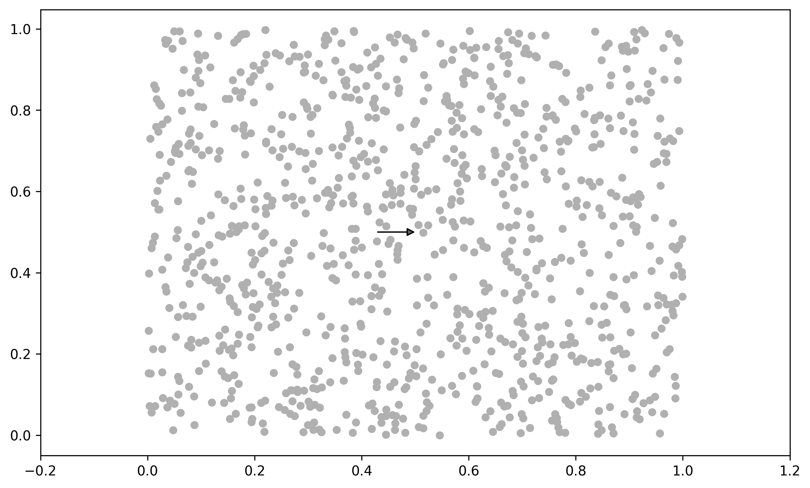

.. code:: ipython3

    import geopandas as gpd
    import pandas as pd
    import numpy as np
    from gerrytools.plotting.data.scatterplot import ScatterPlot

.. code:: ipython3

    def make_random_points(n_points = 1000):
        return np.random.random(size=n_points), np.random.random(size=n_points)

.. code:: ipython3

    from gerrytools.plotting import LabelArrowStyle
    plot = ScatterPlot()
    x,y = make_random_points()
    plot.add_scatter(x,y)
    
    plot.add_label_arrow(
        (0.5, 0.5),
        "right",
        arrow_length=5,
        
    )
    
    plot.show()

.. code:: ipython3

    from enum import StrEnum
    
    class FooBar(StrEnum):
        FOO = "foo"
        BAR = "bar"

