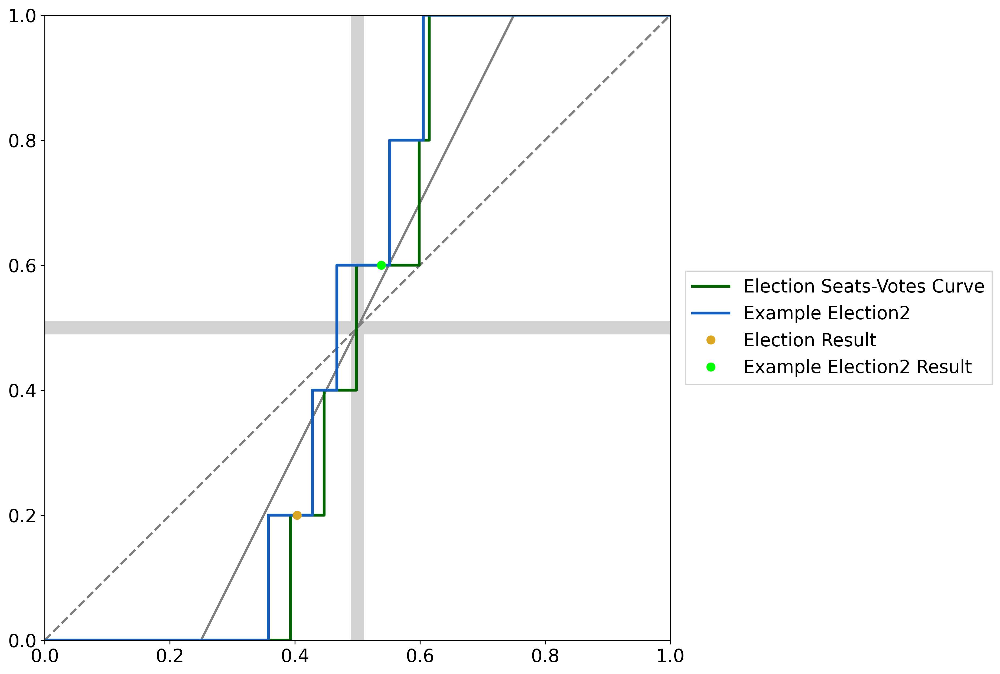
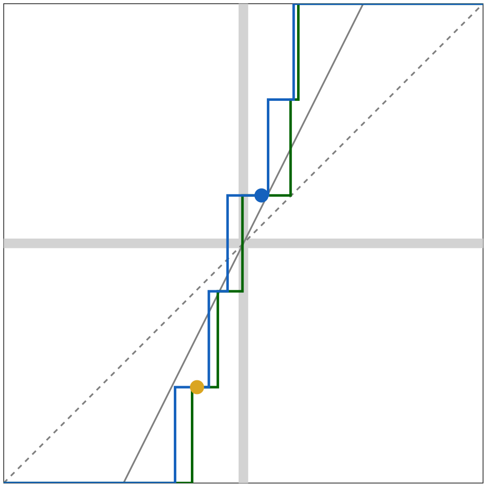

.. code:: ipython3

    import numpy as np

.. code:: ipython3

    d_votes = np.array([100, 200, 300, 400, 500])
    total_votes = np.array([328, 693, 588, 876, 1234])
    
    def generate_votes():
        return np.random.randint(100, 800, size=5)
    
    def generate_total_votes(party_votes):
        return np.random.randint(100, 800, size=5) + party_votes

.. code:: ipython3

    from gerrytools.plotting import SeatsVotes

.. code:: ipython3

    sv_plot = SeatsVotes()
    # sv_plot = SeatsVotes(include_legend=False)
    
    sv_plot.add_seat_votes_data(
        pov_party_vote_shares=d_votes,
        total_vote_shares=total_votes,
    )
    sv_plot.add_seat_votes_data(
        pov_party_vote_shares=list(map(lambda x: x + 100, d_votes)),
        total_vote_shares=total_votes,
        name="Example Election2",
        linecolor="denim",
        markercolor="green",
        markerlabel="Example Election2 Result",
    )
    
    # sv_plot.remove_crosshairs()
    sv_plot.add_proportionality_line()
    sv_plot.add_efficiency_gap_line()
    sv_plot.hide_additional_lines_in_legend()
    # sv_plot.hide_election_markers()
    
    sv_plot.show()

.. code:: ipython3

    from gerrytools.latex import SeatsVotes as LatexSeatsVotes

.. code:: ipython3

    sv_plot = LatexSeatsVotes()
    # sv_plot = SeatsVotes(include_legend=False)
    
    sv_plot.add_seat_votes_data(
        pov_party_vote_shares=d_votes,
        total_vote_shares=total_votes,
    )
    sv_plot.add_seat_votes_data(
        pov_party_vote_shares=list(map(lambda x: x + 100, d_votes)),
        total_vote_shares=total_votes,
        # name="Example Election2",
        linecolor="denim",
        markercolor="denim",
        # markerlabel="Example Election2 Result",
    )
    
    # # sv_plot.remove_crosshairs()
    sv_plot.add_proportionality_line()
    sv_plot.add_efficiency_gap_line()
    sv_plot.hide_additional_lines_in_legend()
    # sv_plot.hide_election_markers()
    print(sv_plot)
    sv_plot.preview()

.. parsed-literal::

    \begin{tikzpicture}
    \begin{scope}[xscale=10.0, yscale=10.0]
    \clip [draw] (0.0000, 0.0000) rectangle (1.0000, 1.0000);
    
    {\color[HTML]{D3D3D3}\fill [fill opacity=1.0000] (0.4900, 0.0000) rectangle (0.5100, 1.0000);}
    {\color[HTML]{D3D3D3}\fill [fill opacity=1.0000] (0.0000, 0.4900) rectangle (1.0000, 0.5100);}
    
    {\color[HTML]{808080}\draw [line width=1.00pt, dashed] (0.0000, 0.0000) -- (1.0000, 1.0000);}
    {\color[HTML]{808080}\draw [line width=1.00pt, solid] (0.2500, 0.0000) -- (0.7500, 1.0000);}
    
    {\color[HTML]{006400}\draw [line width=1.50pt] (0.0000, 0.0000) -- (0.0000, 0.0000) -- (0.3931, 0.0000) -- (0.3931, 0.2000) -- (0.4467, 0.2000) -- (0.4467, 0.4000) -- (0.4981, 0.4000) -- (0.4981, 0.6000) -- (0.5985, 0.6000) -- (0.5985, 0.8000) -- (0.6147, 0.8000) -- (0.6147, 1.0000) -- (1.0000, 1.0000);}
    {\color{denim}\draw [line width=1.50pt] (0.0000, 0.0000) -- (0.0000, 0.0000) -- (0.3575, 0.0000) -- (0.3575, 0.2000) -- (0.4280, 0.2000) -- (0.4280, 0.4000) -- (0.4670, 0.4000) -- (0.4670, 0.6000) -- (0.5516, 0.6000) -- (0.5516, 0.8000) -- (0.6049, 0.8000) -- (0.6049, 1.0000) -- (1.0000, 1.0000);}
    
    {\color[HTML]{DAA520}\node [circle, inner sep=0pt, minimum size=8.00pt, fill, draw] at (0.4033, 0.2000) {};}
    {\color{denim}\node [circle, inner sep=0pt, minimum size=8.00pt, fill, draw] at (0.5378, 0.6000) {};}
    \end{scope}
    \end{tikzpicture}
    

