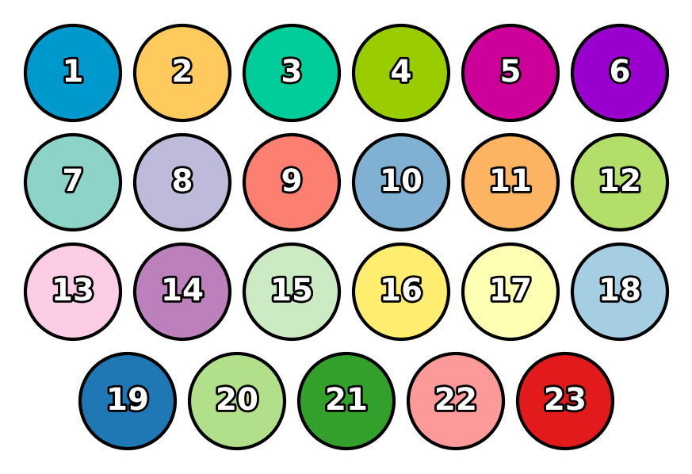
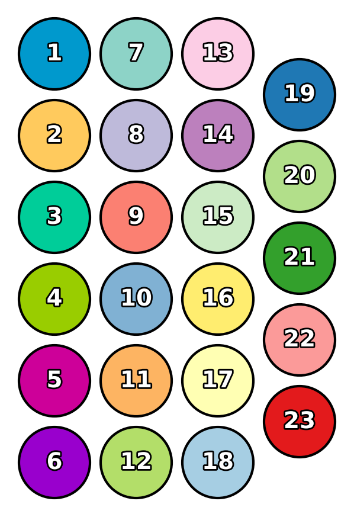

.. code:: ipython3

    from gerrytools.plotting.subway import subway_signs, SubwaySignOptions

.. parsed-literal::

    /mnt/efs/h/Dropbox/MADLAB/Git_Repos/peter/gerrytools-dev/gerrytools/__init__.py:9: UserWarning: pygeos support was removed in 1.0. geopandas.use_pygeos is a no-op and will be removed in geopandas 1.1.
      geopandas.options.use_pygeos = False

.. code:: ipython3

    import matplotlib.pyplot as plt
    from gerrytools.colors import districtr
    import random
    
    random.seed(42)
    
    
    n_colors = 23
    colors = []
    # colors += [
    #     "denim",
    #     "alizarin",
    #     "amber",
    #     "forestgreen",
    #     "purpleheart",
    #     "cherryblossompink",
    #     "tangerine",
    #     "teal",
    #     "darkgray",
    #     "#444444",
    #     "royalblue"
    # ]
    colors += districtr(n_colors)
    labels = [str(i) for i in range(1, len(colors) + 1)]
    
    # labels = labels[::-1]
    # colors = colors[::-1]
    
    # labels = list(range(16, 22)) + list(range(10, 16)) + list(range(4, 10)) + list(range(1, 4))
    # colors = [colors[i-1] for i in labels]
    
    
    subway_signs(
        colors,
        labels,
        max_items_per_band=6,
        # n_bands=5,
        # orientation="vertical",
        # orientation="horizontal",
        # reverse_display_order=True,
        # save_fig_path="subway_districtr.png"
        # save_fig_path="subway_districtr_reverse_order.png"
        # save_fig_path="subway_districtr_flipped.png"
        # sign_options=SubwaySignOptions(raggededge="last")
        # sign_options=SubwaySignOptions(raggededge="first")
    )

.. code:: ipython3

    n_colors = 23
    colors = districtr(n_colors)
    labels = [str(i) for i in range(1, len(colors) + 1)]
    
    
    subway_signs(
        colors,
        labels,
        n_bands=4,
        orientation="vertical"
    )

