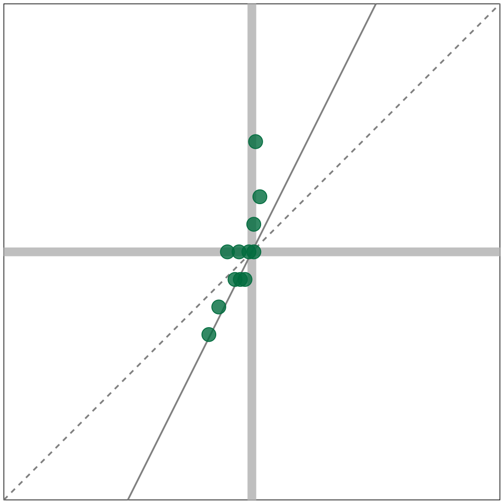
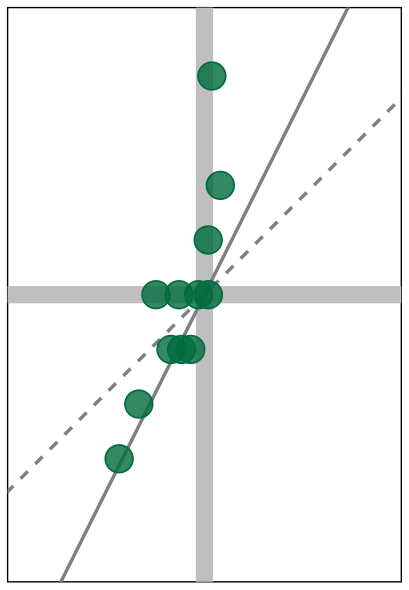
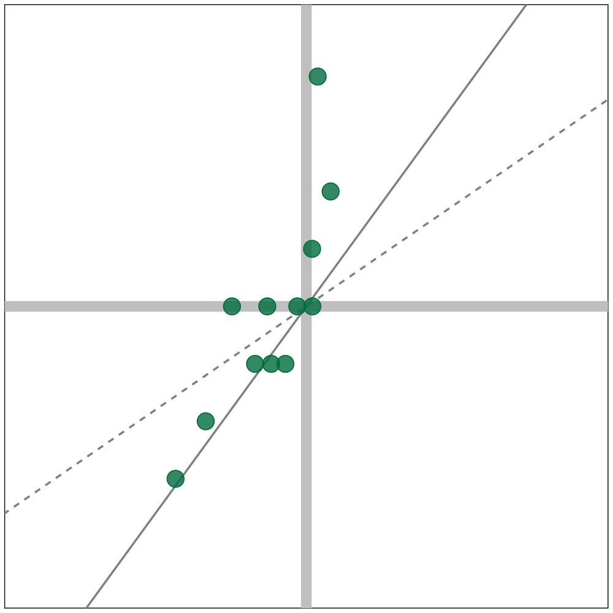
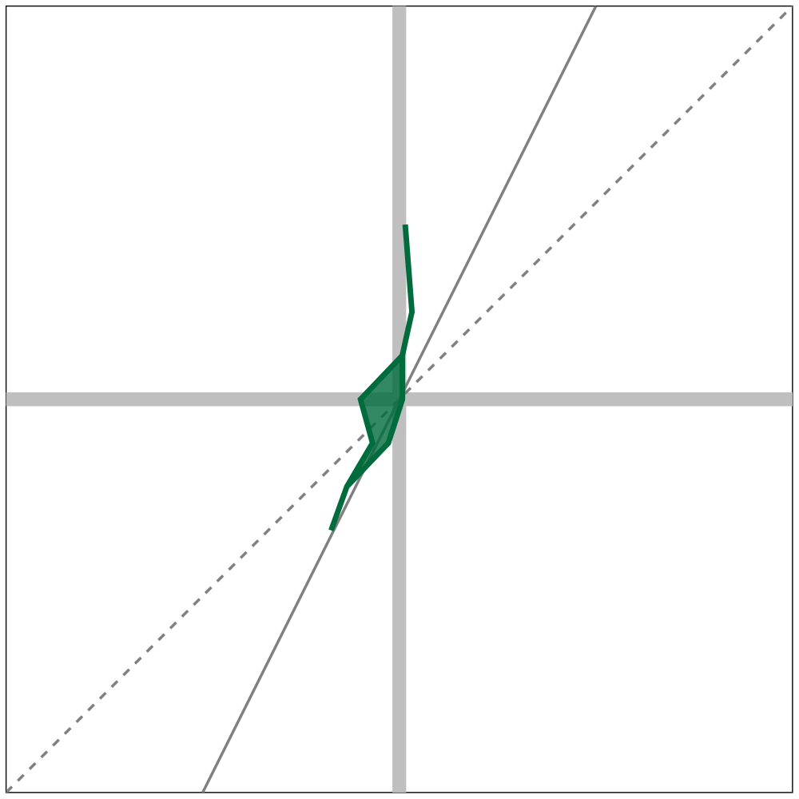
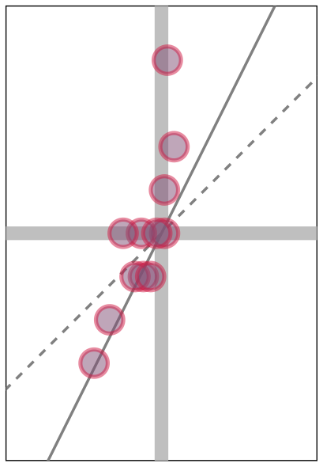
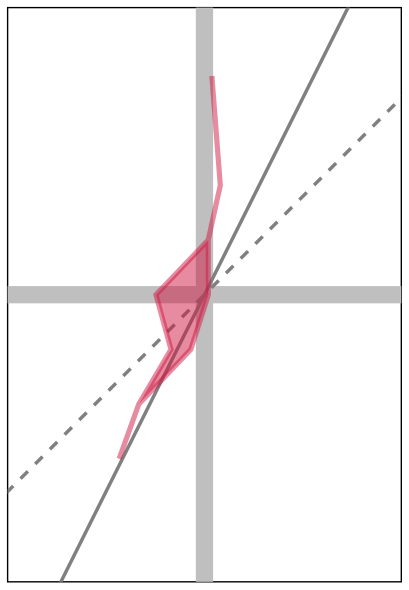
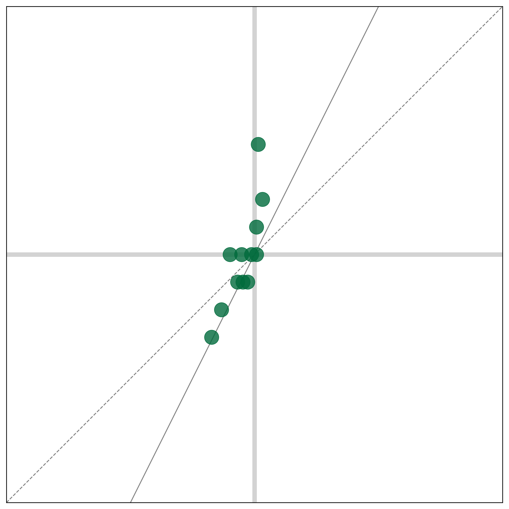

Working with the ``PaintBall`` class
------------------------------------

The ``PaintBall`` class is intended to be a user-friendly way to
generate and preview the “paintball” plots that sometimes appear in
reports authored by the Data and Democracy Lab.

   NOTE: Usage of the ``preview`` function of the ``PaintBall`` class
   does require a latex compiler be installed on the machine that you
   are working from.

Basic construction
~~~~~~~~~~~~~~~~~~

The ``PaintBall`` class comes with a basic previewer and a minimal
interface so that producing the plot is as painless as possible. By
default, the plot will display the region :math:`[0,1] \times [0,1]` and
will show the proporitionality line (dashed grey) and the efficiency-gap
line (solid grey).

.. code:: ipython3

    from gerrytools.latex import PaintBall
    plot = PaintBall(
        voteshare_data=[0.4925, 0.5233, 0.4960, 0.5259, 0.4839, 0.5340, 0.5867, 0.4962, 0.5667, 0.5139, 0.5060, 0.5493],
        seats_data=[5,10,9,9,7,10,12,8,11,10,9,9],
        maximum_seats=18
    )
    
    plot.print()
    plot.preview()

.. parsed-literal::

    \begin{tikzpicture}
    \begin{scope}[xscale=10.0, yscale=10.0]
    
    \clip [draw] (0.0, 0.0) rectangle (1.0, 1.0);
    
    \draw [line width=5.0pt, color=gray!50] (0.5, 0) -- (0.5, 1);
    \draw [line width=5.0pt, color=gray!50] (0, 0.5) -- (1, 0.5);
    
    \draw [color=gray, line width=1.0pt, solid] (0.25, 0.0) -- (0.75, 1.0);
    \draw [color=gray, line width=1.0pt, dashed] (0.0, 0.0) -- (1.0, 1.0);
    
    \foreach \votes/\seats in {
        0.4925/0.2778,
        0.5233/0.5556,
        0.496/0.5,
        0.5259/0.5,
        0.4839/0.3889,
        0.534/0.5556,
        0.5867/0.6667,
        0.4962/0.4444,
        0.5667/0.6111,
        0.5139/0.5556,
        0.506/0.5,
        0.5493/0.5
    } {
        \node[transform shape=false, circle , fill=cadmiumgreen, fill opacity=0.8, inner sep=0pt, minimum size=8.0pt, draw=cadmiumgreen, line width=0.5, draw opacity=1.0] 
        at (1-\votes, 1-\seats) {{}};
    }
    
    \end{scope}
    \end{tikzpicture}
    

In the creation of the plot object, it is also possible to just pass the
seatshare data to the constructor rather than passing the seats and the
maximum number of allowable seats.

.. code:: ipython3

    import numpy as np
    
    plot = PaintBall(
        voteshare_data=[0.4925, 0.5233, 0.4960, 0.5259, 0.4839, 0.5340, 0.5867, 0.4962, 0.5667, 0.5139, 0.5060, 0.5493],
        seats_data=np.array([5,10,9,9,7,10,12,8,11,10,9,9])/18,
    )
    plot.preview()

.. image:: using_paintball_files/using_paintball_4_0.png

Frequently, when working with paintball plots, it is desirable to adjust
the :math:`x` and :math:`y` limits. There are functions that accomplish
this, and, by default, they also rescale the image so that the aspect
ratio is still 1-1.

.. code:: ipython3

    plot = PaintBall(
        voteshare_data=[0.4925, 0.5233, 0.4960, 0.5259, 0.4839, 0.5340, 0.5867, 0.4962, 0.5667, 0.5139, 0.5060, 0.5493],
        seats_data=[5,10,9,9,7,10,12,8,11,10,9,9],
        maximum_seats=18
    )
    
    plot.set_xlim(0.3, 0.7)
    plot.set_ylim(3.75/18, 14.25/18)
    plot.preview()

If rescaling is undesirable, then there is a parameter that allows users
to avoid this:

.. code:: ipython3

    plot = PaintBall(
        voteshare_data=[0.4925, 0.5233, 0.4960, 0.5259, 0.4839, 0.5340, 0.5867, 0.4962, 0.5667, 0.5139, 0.5060, 0.5493],
        seats_data=[5,10,9,9,7,10,12,8,11,10,9,9],
        maximum_seats=18
    )
    
    plot.set_xlim(0.3, 0.7, rescale = True)
    plot.set_ylim(3.75/18, 14.25/18, rescale = True)
    plot.preview()

In addition to the main paintball plot, there is also an option to
generate and preview the horizontal hull of the paintball plot.

.. code:: ipython3

    plot = PaintBall(
        voteshare_data=[0.4925, 0.5233, 0.4960, 0.5259, 0.4839, 0.5340, 0.5867, 0.4962, 0.5667, 0.5139, 0.5060, 0.5493],
        seats_data=[5,10,9,9,7,10,12,8,11,10,9,9],
        maximum_seats=18
    )
    plot.print(hull=True)
    plot.preview(hull=True)

.. parsed-literal::

    \begin{tikzpicture}
    \begin{scope}[xscale=10.0, yscale=10.0]
    
    \clip [draw] (0.0, 0.0) rectangle (1.0, 1.0);
    
    \draw [line width=5.0pt, color=gray!50] (0.5, 0) -- (0.5, 1);
    \draw [line width=5.0pt, color=gray!50] (0, 0.5) -- (1, 0.5);
    
    \draw [color=gray, line width=1.0pt, solid] (0.25, 0.0) -- (0.75, 1.0);
    \draw [color=gray, line width=1.0pt, dashed] (0.0, 0.0) -- (1.0, 1.0);
    
    \draw [fill=cadmiumgreen, fill opacity=0.8, line width=2.0, color=cadmiumgreen, draw opacity=1.0] 
      (0.4133,0.3333)--
      (0.4333,0.3889)--
      (0.466,0.4444)--
      (0.4507,0.5)--
      (0.5038,0.5556)--
      (0.5161,0.6111)--
      (0.5075,0.7222)--
      (0.5075,0.7222)--
      (0.5161,0.6111)--
      (0.5038,0.5556)--
      (0.504,0.5)--
      (0.4861,0.4444)--
      (0.4333,0.3889)--
      (0.4133,0.3333);
    
    \end{scope}
    \end{tikzpicture}
    

Other Possible modifications
----------------------------

.. code:: ipython3

    plot = PaintBall(
        voteshare_data=[0.4925, 0.5233, 0.4960, 0.5259, 0.4839, 0.5340, 0.5867, 0.4962, 0.5667, 0.5139, 0.5060, 0.5493],
        seats_data=[5,10,9,9,7,10,12,8,11,10,9,9],
        maximum_seats=18
    )
    
    plot.set_xlim(0.3, 0.7)
    plot.set_ylim(3.75/18, 14.25/18)
    plot.set_marker_options(
        size=10,
        color="alizarin!50!tab:blue",
        alpha=0.5,
        edgecolor="alizarin",
        edgewidth=1.5,
        edgealpha=0.5
    )
    plot.preview()

.. code:: ipython3

    plot = PaintBall(
        voteshare_data=[0.4925, 0.5233, 0.4960, 0.5259, 0.4839, 0.5340, 0.5867, 0.4962, 0.5667, 0.5139, 0.5060, 0.5493],
        seats_data=[5,10,9,9,7,10,12,8,11,10,9,9],
        maximum_seats=18
    )
    
    plot.set_xlim(0.3, 0.7)
    plot.set_ylim(3.75/18, 14.25/18)
    plot.set_hull_options(
        color="alizarin",
        alpha=0.5,
        edgecolor="alizarin",
        edgewidth=1.5,
        edgealpha=0.5
    )
    plot.preview(hull=True)

.. code:: ipython3

    from gerrytools.plotting.data.paintball import PaintBall as PaintBallPlot

.. code:: ipython3

    plot = PaintBallPlot(
        voteshare_data=[0.4925, 0.5233, 0.4960, 0.5259, 0.4839, 0.5340, 0.5867, 0.4962, 0.5667, 0.5139, 0.5060, 0.5493],
        seats_data=[5,10,9,9,7,10,12,8,11,10,9,9],
        maximum_seats=18
    )
    
    # plot.set_xlim(0.3, 0.7)
    # plot.set_ylim(3.75/18, 14.25/18)
    # plot.set_hull_options(
    #     color="alizarin",
    #     alpha=0.5,
    #     edgecolor="alizarin",
    #     edgewidth=1.5,
    #     edgealpha=0.5
    # )
    plot.show()

