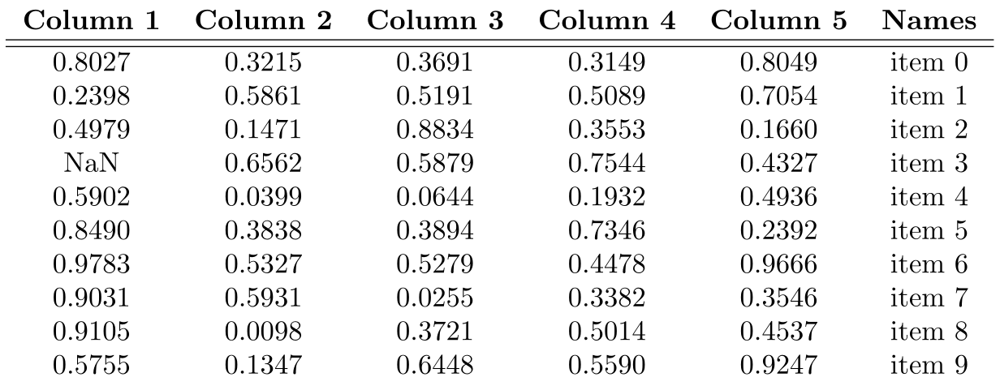
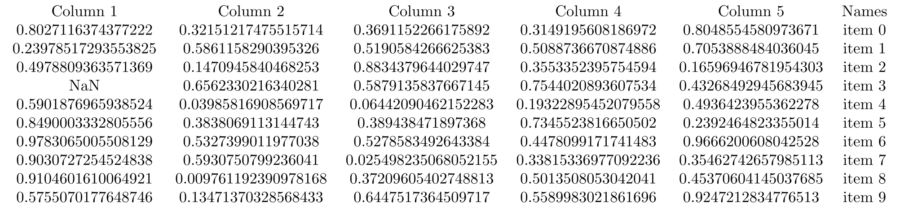
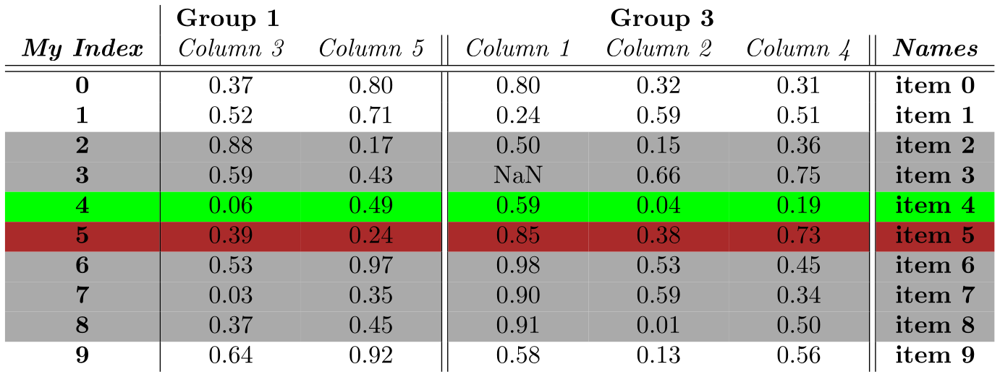
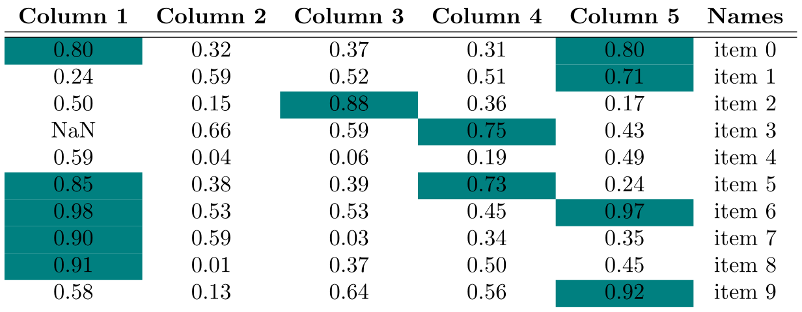
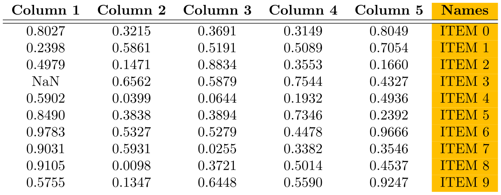
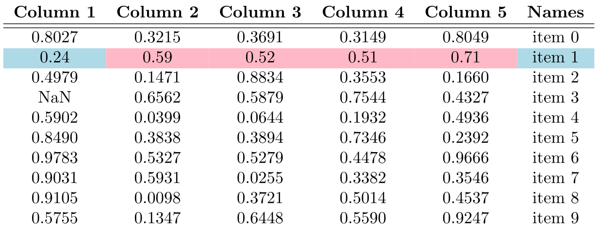
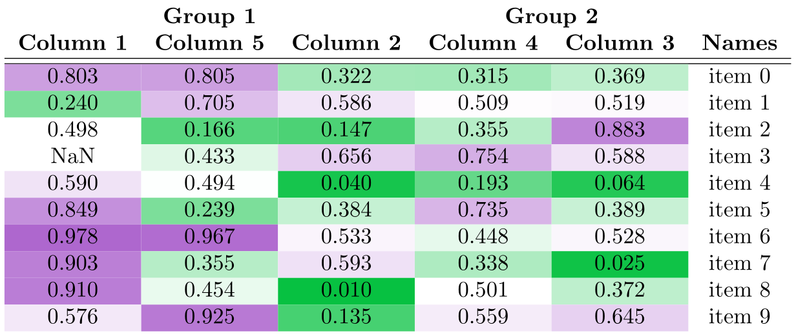

Working with the ``TexTable`` class
-----------------------------------

The ``TexTable`` class is intended to be a user-friendly way to generate
and preview nice tables in latex. Currenly, the class only supports
working with pandas dataframes, and while pandas does profide a
``to_latex`` function, it has limited functionaity and is more
troublesome to modify. The ``TexTable`` class intends to be more
flexible and to alleviate the majority of the most troublesome things
that come with generating a latex table.

   NOTE: Usage of the ``preview`` function of the ``TexTable`` class
   does require a latex compiler be installed on the machine that you
   are working from.

Basic construction
~~~~~~~~~~~~~~~~~~

The ``TexTable`` class comes with a basic previewer and some default
settings that are intended to turn most data tables into a nice format

- All columns are “c” aligned
- Columns headers are bolded
- There is a double “:raw-latex:`\hline`” under the header
- Numbers are rounded to 4 decimal places

.. code:: ipython3

    from gerrytools.latex import TexTable
    import numpy as np
    import pandas as pd
    
    matrix = [
        [0.80271163743772220, 0.321512174755157140, 0.369115226617589200, 0.31491956081869720, 0.80485545809736710, 'item 0'],
        [0.23978517293553825, 0.586115829039532600, 0.519058426662538300, 0.50887366708748860, 0.70538884840360450, 'item 1'],
        [0.49788093635713690, 0.147094584046825300, 0.883437964402974700, 0.35533523957545940, 0.16596946781954303, 'item 2'],
        [np.nan,              0.656233021634028100, 0.587913583766714500, 0.75440208936075340, 0.43268492945683945, 'item 3'],
        [0.59018769659385240, 0.039858169085697170, 0.064420904621522830, 0.19322895452079558, 0.49364239553622780, 'item 4'],
        [0.84900033328055560, 0.383806911314474300, 0.389438471897368000, 0.73455238166505020, 0.23924648233550140, 'item 5'],
        [0.97830650055081290, 0.532739901197703800, 0.527858349264338400, 0.44780991717414830, 0.96662006080425280, 'item 6'],
        [0.90307272545248380, 0.593075079923604100, 0.025498235068052155, 0.33815336977092236, 0.35462742657985113, 'item 7'],
        [0.91046016100649210, 0.009761192390978168, 0.372096054027488130, 0.50135080530420410, 0.45370604145037685, 'item 8'],
        [0.57550701776487460, 0.134713703285684330, 0.644751736450971700, 0.55899830218616960, 0.92472128347765130, 'item 9']
    ]
    
    
    df = pd.DataFrame(matrix, columns=[f"Column {i}" for i in range(1, 6)] + ["Names"])
    table = TexTable(df)
    
    print(table)  # Print out the generated LaTeX code 
    table.preview()  # Preview the table in either a pop-up window or in the Jupyter notebook
    print(table.document) # Print out the full LaTeX document code containing the table

.. parsed-literal::

    \begin{tabular}{cccccc}
    \textbf{Column 1} & \textbf{Column 2} & \textbf{Column 3} & \textbf{Column 4} & \textbf{Column 5} & \textbf{Names} \\
    \hline\hline
    0.8027 & 0.3215 & 0.3691 & 0.3149 & 0.8049 & item 0 \\
    0.2398 & 0.5861 & 0.5191 & 0.5089 & 0.7054 & item 1 \\
    0.4979 & 0.1471 & 0.8834 & 0.3553 & 0.1660 & item 2 \\
    NaN & 0.6562 & 0.5879 & 0.7544 & 0.4327 & item 3 \\
    0.5902 & 0.0399 & 0.0644 & 0.1932 & 0.4936 & item 4 \\
    0.8490 & 0.3838 & 0.3894 & 0.7346 & 0.2392 & item 5 \\
    0.9783 & 0.5327 & 0.5279 & 0.4478 & 0.9666 & item 6 \\
    0.9031 & 0.5931 & 0.0255 & 0.3382 & 0.3546 & item 7 \\
    0.9105 & 0.0098 & 0.3721 & 0.5014 & 0.4537 & item 8 \\
    0.5755 & 0.1347 & 0.6448 & 0.5590 & 0.9247 & item 9 \\
    \end{tabular}

.. parsed-literal::

    \documentclass[border=2pt]{standalone}
    \usepackage{amsmath}
    \usepackage{amssymb}
    \usepackage{graphicx}
    \usepackage{booktabs}
    \usepackage{array}
    \usepackage{latexcolors}
    \usepackage{siunitx}
    \usepackage{xfp}
    \usepackage{colortbl}
    \definecolor{snsgreen}{rgb}{0.16,0.51,0.25}
    \definecolor{snspurple}{rgb}{0.50,0.24,0.55}
    \begin{document}
    \begin{tabular}{cccccc}
    \textbf{Column 1} & \textbf{Column 2} & \textbf{Column 3} & \textbf{Column 4} & \textbf{Column 5} & \textbf{Names} \\
    \hline\hline
    0.8027 & 0.3215 & 0.3691 & 0.3149 & 0.8049 & item 0 \\
    0.2398 & 0.5861 & 0.5191 & 0.5089 & 0.7054 & item 1 \\
    0.4979 & 0.1471 & 0.8834 & 0.3553 & 0.1660 & item 2 \\
    NaN & 0.6562 & 0.5879 & 0.7544 & 0.4327 & item 3 \\
    0.5902 & 0.0399 & 0.0644 & 0.1932 & 0.4936 & item 4 \\
    0.8490 & 0.3838 & 0.3894 & 0.7346 & 0.2392 & item 5 \\
    0.9783 & 0.5327 & 0.5279 & 0.4478 & 0.9666 & item 6 \\
    0.9031 & 0.5931 & 0.0255 & 0.3382 & 0.3546 & item 7 \\
    0.9105 & 0.0098 & 0.3721 & 0.5014 & 0.4537 & item 8 \\
    0.5755 & 0.1347 & 0.6448 & 0.5590 & 0.9247 & item 9 \\
    \end{tabular}
    \end{document}

Of course, if you do not like any of these options, you may clear them
and start fresh:

.. code:: ipython3

    table = TexTable(df)
    
    table.clear_options()
    print(table)
    table.preview()

.. parsed-literal::

    \begin{tabular}{cccccc}
    Column 1 & Column 2 & Column 3 & Column 4 & Column 5 & Names \\
    0.8027116374377222 & 0.32151217475515714 & 0.3691152266175892 & 0.3149195608186972 & 0.8048554580973671 & item 0 \\
    0.23978517293553825 & 0.5861158290395326 & 0.5190584266625383 & 0.5088736670874886 & 0.7053888484036045 & item 1 \\
    0.4978809363571369 & 0.1470945840468253 & 0.8834379644029747 & 0.3553352395754594 & 0.16596946781954303 & item 2 \\
    NaN & 0.6562330216340281 & 0.5879135837667145 & 0.7544020893607534 & 0.43268492945683945 & item 3 \\
    0.5901876965938524 & 0.03985816908569717 & 0.06442090462152283 & 0.19322895452079558 & 0.4936423955362278 & item 4 \\
    0.8490003332805556 & 0.3838069113144743 & 0.389438471897368 & 0.7345523816650502 & 0.2392464823355014 & item 5 \\
    0.9783065005508129 & 0.5327399011977038 & 0.5278583492643384 & 0.4478099171741483 & 0.9666200608042528 & item 6 \\
    0.9030727254524838 & 0.5930750799236041 & 0.025498235068052155 & 0.33815336977092236 & 0.35462742657985113 & item 7 \\
    0.9104601610064921 & 0.009761192390978168 & 0.37209605402748813 & 0.5013508053042041 & 0.45370604145037685 & item 8 \\
    0.5755070177648746 & 0.13471370328568433 & 0.6447517364509717 & 0.5589983021861696 & 0.9247212834776513 & item 9 \\
    \end{tabular}

Simple modifications to the table
~~~~~~~~~~~~~~~~~~~~~~~~~~~~~~~~~

There are a liteny of small changes that can be made to any table. Below
is a list of some of the more basic things:

FEATURE ADDITION:

- ``include_index``: Adds the DataFrame index column to/from the LaTeX
  table
- ``add_hrule_above``: Adds a horizontal rule above the specified rows.
  Starts from row 0 which is the row below the header.
- ``add_toprule``: Adds a horizontal rule to the top of the table
- ``add_bottomrule``: Adds a horizontal rule to the bottom of the table
- ``add_hrule_above_all``: Adds one more hrule above all data rows.
- ``add_vrule_left_of`` / ``add_vrule_right_of``: Add a vertical rule to
  the left/right of specified column index. Column “0” corresponds to
  the first column of the dataframe.
- ``add_vrule_all``: Adds vertical rules around all columns of the
  table.
- ``highlight_rows``: Allows for the highlighting of specific rows in
  the LaTeX table.

FEATURE REMOVAL:

- ``remove_index``: Removes the index column
- ``remove_toprule``: Removes the horzontal rule from the top of the
  table.
- ``remove_bottomrule``: Removes the horzontal rule from the bottom of
  the table.
- ``clear_all_hrule``: Removes all horizonal rules from the body of the
  table.
- ``clear_all_vrule``: Removes all vertical rules from the body of the
  table.

ADDITIONAL OPTION SETTERS:

- ``set_column_headers_text_format``: Set all of the column headers to
  bold or italic.
- ``set_decimal_count``: Set the number of decimal places to round float
  values to in the table.
- ``set_hrule_command``: Change the command for drawing horizontal
  rules. Default is “:raw-latex:`\hline`”
- ``set_toprule_command``: Change the command for drawing the top rule.
  Defaults to be the same as the hrule command.
- ``set_bottomrule_command``: Change the command for drawing the bottom
  rule. Defaults to be the same as the hrule command.
- ``set_all_hrule``: Set the number of horizontal rules above all
  columns in the data table.
- ``set_nan_string``: Change how ``numpy.nan`` values appear in the
  table. Default is “NaN”.
- ``set_tabular_format``: Change the formatting of the tabular columns.
  Supports richer specifications like
  “c>{:raw-latex:`\bfseries`}l||l@{}r”
- ``set_header_groups``: Groups some of the columns together underneath
  one grouped header. For example, if the table has columns [“Col1”,
  “Col2”, “Col3”], then you may call
  ``set_header_groups({"GroupA": ["Col1", "Col2"], "GroupB": ["Col3"]}``.
- ``set_group_headers_text_format``: Set all of the column group headers
  to bold or itallic.
- ``set_goup_tabular_format``: Change the formatting of the grouped
  column headers. Supports richer specifications like
  “c>{:raw-latex:`\bfseries`}l||l@{}r”.
- ``clear_header_groups``: Remove any of the header groups that have
  been set.

.. code:: ipython3

    # Example: Add some vertical rules, hightlight some rows, set total decimal places to 2, and group
    # some of the columns
    
    table = TexTable(df)
    
    table.set_header_groups({
        "Group 1": ["Column 3", "Column 5"],
        "Group 3": ["Column 1", "Column 2", "Column 4"]
    })
    table.set_group_tabular_format("lc")
    table.set_tabular_format(r"cc||ccc||>{\bfseries}c")
    table.include_index(name="My Index", alignment=r">{\bfseries}c|")
    table.highlight_rows([2,3], color = "red!50!blue!67!green!50!white")
    table.highlight_rows([4], color = "green")
    table.highlight_rows([5], color = (0.33/2+1/2,0.33/2,0.33/2))
    table.highlight_rows([6], color = (0.33/2+1/2,0.33/2+1/2,0.33/2+1/2))
    table.highlight_rows([7], color = "#aaaaaa")
    table.highlight_rows([8], color = "red!50!blue!67!green!50!white")
    table.set_decimal_count(2)
    table.set_column_headers_text_format(bold=False, italic=True)
    
    print(table)
    table.preview()

.. parsed-literal::

    \begin{tabular}{>{\bfseries}c|cc||ccc||>{\bfseries}c}
    \multicolumn{1}{>{\bfseries}>{\bfseries}c|}{} & \multicolumn{2}{l}{\textbf{Group 1}} & \multicolumn{3}{c}{\textbf{Group 3}} & \multicolumn{1}{c}{} \\
    \textit{My Index} & \textit{Column 3} & \textit{Column 5} & \textit{Column 1} & \textit{Column 2} & \textit{Column 4} & \textit{Names} \\
    \hline\hline
    0 & 0.37 & 0.80 & 0.80 & 0.32 & 0.31 & item 0 \\
    1 & 0.52 & 0.71 & 0.24 & 0.59 & 0.51 & item 1 \\
    \rowcolor[HTML]{aaaaaa}
    2 & 0.88 & 0.17 & 0.50 & 0.15 & 0.36 & item 2 \\
    \rowcolor[HTML]{aaaaaa}
    3 & 0.59 & 0.43 & NaN & 0.66 & 0.75 & item 3 \\
    \rowcolor[HTML]{00ff00}
    4 & 0.06 & 0.49 & 0.59 & 0.04 & 0.19 & item 4 \\
    \rowcolor[rgb]{0.665,0.165,0.165}
    5 & 0.39 & 0.24 & 0.85 & 0.38 & 0.73 & item 5 \\
    \rowcolor[rgb]{0.665,0.665,0.665}
    6 & 0.53 & 0.97 & 0.98 & 0.53 & 0.45 & item 6 \\
    \rowcolor[HTML]{aaaaaa}
    7 & 0.03 & 0.35 & 0.90 & 0.59 & 0.34 & item 7 \\
    \rowcolor[HTML]{aaaaaa}
    8 & 0.37 & 0.45 & 0.91 & 0.01 & 0.50 & item 8 \\
    9 & 0.64 & 0.92 & 0.58 & 0.13 & 0.56 & item 9 \\
    \end{tabular}

.. code:: ipython3

    from matplotlib.colors import to_rgb, to_hex
    
    def mix_colors(c1, c2, w1=0.5):
        """
        Mix two colors c1 and c2 with weight w1 for c1 and (1 - w1) for c2.
        c1, c2 can be any Matplotlib color: 'red', '#ff00ff', (r, g, b), etc.
        """
        w2 = 1.0 - w1
        r1, g1, b1 = to_rgb(c1)
        r2, g2, b2 = to_rgb(c2)
        mixed = (
            w1 * r1 + w2 * r2,
            w1 * g1 + w2 * g2,
            w1 * b1 + w2 * b2
        )
        return mixed
    
    def mix_colors_hex(c1, c2, w1=0.5):
        return to_hex(mix_colors(c1, c2, w1))
    
    
    
    amber = (1.0, 0.75, 0.0)
    apple_green = (0.55, 0.71, 0.0)
    gray  = (0.5, 0.5, 0.5)    
    
    print(mix_colors_hex(amber, gray, 0.8))
    print(mix_colors_hex(apple_green, gray, 0.6))

.. parsed-literal::

    #e6b319
    #87a033

Advanced table modifications
~~~~~~~~~~~~~~~~~~~~~~~~~~~~

In addition to the simple modifications that you can make to the table,
you can change the way that the various formatters within the table
operate and even add gradient commands to the document. You can even add
multiple levels of formatter to individual columns or rows of the table
with the formattter priority hierarchy being

1. Column formatters
2. Row formatters
3. Type formatters

.. code:: ipython3

    from gerrytools.latex.formatters import round_decimals, highlight_gt, compose_formatters
    
    
    table = TexTable(df)
    
    # Composition works like function composition, so `compose_formatters(f, g)(x) = f(g(x))`
    
    table.set_number_formatter(compose_formatters(
        highlight_gt(0.7, color="teal"),
        round_decimals(2)
    ))
    
    table.preview()

.. code:: ipython3

    table = TexTable(df)
    
    
    def make_strings_uppercase(x):
        if isinstance(x, str):
            return x.upper()
        return x
    
    
    table.set_string_formatter(make_strings_uppercase)
    table.set_tabular_format(r"ccccc>{\cellcolor{amber}}c")
    table.preview()

.. code:: ipython3

    from gerrytools.latex.formatters import round_decimals, highlight_gt, compose_formatters
    
    table = TexTable(df)
    
    table.set_row_formatter(1, compose_formatters(highlight_gt(0.5, color="cherryblossompink"), round_decimals(2)))
    table.highlight_rows(1, color="lightblue")
    
    table.preview()

The ``TexTable`` class also has a latex “document” as an attribute which
is used in the rendering of the preview. This attached document class
has some built-in functionality that allows for the addition of custom
LaTeX commands.

When working with reports, it is rather common to want to impose a
gradient onto a table, but the command for that is a bit tricky to get
right, so GerryTools comes with some pre-made functions that make this
process easier. Below is an example of how to use such a function:

.. code:: ipython3

    from gerrytools.latex.formatters import round_decimals, wrap_with_tex_command, compose_formatters
    from gerrytools.latex.commands import tex_diverging_gradient_command
    
    table = TexTable(df)
    
    table.set_header_groups({"Group 1": ["Column 1", "Column 5", "Column 2"], "Group 2": ["Column 4", "Column 3"]})
    
    table.set_number_formatter(
        compose_formatters(
            wrap_with_tex_command("myheatmap"),
            round_decimals(3),
        )
    )
    
    table.document.add_command(tex_diverging_gradient_command("myheatmap"))
    
    
    print(table.document)
    table.preview()

.. parsed-literal::

    \documentclass[border=2pt]{standalone}
    \usepackage{amsmath}
    \usepackage{amssymb}
    \usepackage{graphicx}
    \usepackage{booktabs}
    \usepackage{array}
    \usepackage{latexcolors}
    \usepackage{siunitx}
    \usepackage{xfp}
    \usepackage{colortbl}
    \definecolor{snsgreen}{rgb}{0.16,0.51,0.25}
    \definecolor{snspurple}{rgb}{0.50,0.24,0.55}
    \colorlet{myheatmapLodarkpastelgreen}{darkpastelgreen}%
    \colorlet{myheatmapHirichlavender}{richlavender}%
    \colorlet{myheatmapMidwhite}{white}%
    \newcommand{\myheatmap}[1]{%
      \begingroup%
      \edef\heatlo{0.0}\edef\heatmid{0.5}\edef\heathi{1.0}%
      \edef\heatx{#1}%
      \edef\heatxc{\fpeval{min(\heathi, max(\heatlo, \heatx))}}%
      \edef\leftw{\fpeval{max(\heatmid-\heatlo, 1e-12)}}%
      \edef\rightw{\fpeval{max(\heathi-\heatmid, 1e-12)}}%
      \ifdim \heatxc pt < \heatmid pt
        \edef\heatpct{\fpeval{round(100*(1-(\heatxc-\heatlo)/\leftw),0)}}%
        \edef\heatcolorspec{myheatmapLodarkpastelgreen!\heatpct!myheatmapMidwhite}%
      \else
        \edef\heatpct{\fpeval{round(100*(1-(\heatxc-\heatmid)/\rightw),0)}}%
        \edef\heatcolorspec{myheatmapMidwhite!\heatpct!myheatmapHirichlavender}%
      \fi
      \expandafter\cellcolor\expandafter{\heatcolorspec}%
      \num[round-precision=4]{#1}%
      \endgroup%
    }
    \begin{document}
    \begin{tabular}{cccccc}
    \multicolumn{3}{c}{\textbf{Group 1}} & \multicolumn{2}{c}{\textbf{Group 2}} & \multicolumn{1}{c}{} \\
    \textbf{Column 1} & \textbf{Column 5} & \textbf{Column 2} & \textbf{Column 4} & \textbf{Column 3} & \textbf{Names} \\
    \hline\hline
    \myheatmap{0.803} & \myheatmap{0.805} & \myheatmap{0.322} & \myheatmap{0.315} & \myheatmap{0.369} & item 0 \\
    \myheatmap{0.240} & \myheatmap{0.705} & \myheatmap{0.586} & \myheatmap{0.509} & \myheatmap{0.519} & item 1 \\
    \myheatmap{0.498} & \myheatmap{0.166} & \myheatmap{0.147} & \myheatmap{0.355} & \myheatmap{0.883} & item 2 \\
    NaN & \myheatmap{0.433} & \myheatmap{0.656} & \myheatmap{0.754} & \myheatmap{0.588} & item 3 \\
    \myheatmap{0.590} & \myheatmap{0.494} & \myheatmap{0.040} & \myheatmap{0.193} & \myheatmap{0.064} & item 4 \\
    \myheatmap{0.849} & \myheatmap{0.239} & \myheatmap{0.384} & \myheatmap{0.735} & \myheatmap{0.389} & item 5 \\
    \myheatmap{0.978} & \myheatmap{0.967} & \myheatmap{0.533} & \myheatmap{0.448} & \myheatmap{0.528} & item 6 \\
    \myheatmap{0.903} & \myheatmap{0.355} & \myheatmap{0.593} & \myheatmap{0.338} & \myheatmap{0.025} & item 7 \\
    \myheatmap{0.910} & \myheatmap{0.454} & \myheatmap{0.010} & \myheatmap{0.501} & \myheatmap{0.372} & item 8 \\
    \myheatmap{0.576} & \myheatmap{0.925} & \myheatmap{0.135} & \myheatmap{0.559} & \myheatmap{0.645} & item 9 \\
    \end{tabular}
    \end{document}

.. code:: ipython3

    table.document

.. parsed-literal::

    \documentclass[border=2pt]{standalone}
    \usepackage{amsmath}
    \usepackage{amssymb}
    \usepackage{graphicx}
    \usepackage{booktabs}
    \usepackage{array}
    \usepackage{latexcolors}
    \usepackage{siunitx}
    \usepackage{xfp}
    \usepackage{colortbl}
    \definecolor{snsgreen}{rgb}{0.16,0.51,0.25}
    \definecolor{snspurple}{rgb}{0.50,0.24,0.55}
    \colorlet{myheatmapLodarkpastelgreen}{darkpastelgreen}%
    \colorlet{myheatmapHirichlavender}{richlavender}%
    \colorlet{myheatmapMidwhite}{white}%
    \newcommand{\myheatmap}[1]{%
      \begingroup%
      \edef\heatlo{0.0}\edef\heatmid{0.5}\edef\heathi{1.0}%
      \edef\heatx{#1}%
      \edef\heatxc{\fpeval{min(\heathi, max(\heatlo, \heatx))}}%
      \edef\leftw{\fpeval{max(\heatmid-\heatlo, 1e-12)}}%
      \edef\rightw{\fpeval{max(\heathi-\heatmid, 1e-12)}}%
      \ifdim \heatxc pt < \heatmid pt
        \edef\heatpct{\fpeval{round(100*(1-(\heatxc-\heatlo)/\leftw),0)}}%
        \edef\heatcolorspec{myheatmapLodarkpastelgreen!\heatpct!myheatmapMidwhite}%
      \else
        \edef\heatpct{\fpeval{round(100*(1-(\heatxc-\heatmid)/\rightw),0)}}%
        \edef\heatcolorspec{myheatmapMidwhite!\heatpct!myheatmapHirichlavender}%
      \fi
      \expandafter\cellcolor\expandafter{\heatcolorspec}%
      \num[round-precision=4]{#1}%
      \endgroup%
    }
    \begin{document}
    \begin{tabular}{cccccc}
    \multicolumn{3}{c}{\textbf{Group 1}} & \multicolumn{2}{c}{\textbf{Group 2}} & \multicolumn{1}{c}{} \\
    \textbf{Column 1} & \textbf{Column 5} & \textbf{Column 2} & \textbf{Column 4} & \textbf{Column 3} & \textbf{Names} \\
    \hline\hline
    \myheatmap{0.803} & \myheatmap{0.805} & \myheatmap{0.322} & \myheatmap{0.315} & \myheatmap{0.369} & item 0 \\
    \myheatmap{0.240} & \myheatmap{0.705} & \myheatmap{0.586} & \myheatmap{0.509} & \myheatmap{0.519} & item 1 \\
    \myheatmap{0.498} & \myheatmap{0.166} & \myheatmap{0.147} & \myheatmap{0.355} & \myheatmap{0.883} & item 2 \\
    NaN & \myheatmap{0.433} & \myheatmap{0.656} & \myheatmap{0.754} & \myheatmap{0.588} & item 3 \\
    \myheatmap{0.590} & \myheatmap{0.494} & \myheatmap{0.040} & \myheatmap{0.193} & \myheatmap{0.064} & item 4 \\
    \myheatmap{0.849} & \myheatmap{0.239} & \myheatmap{0.384} & \myheatmap{0.735} & \myheatmap{0.389} & item 5 \\
    \myheatmap{0.978} & \myheatmap{0.967} & \myheatmap{0.533} & \myheatmap{0.448} & \myheatmap{0.528} & item 6 \\
    \myheatmap{0.903} & \myheatmap{0.355} & \myheatmap{0.593} & \myheatmap{0.338} & \myheatmap{0.025} & item 7 \\
    \myheatmap{0.910} & \myheatmap{0.454} & \myheatmap{0.010} & \myheatmap{0.501} & \myheatmap{0.372} & item 8 \\
    \myheatmap{0.576} & \myheatmap{0.925} & \myheatmap{0.135} & \myheatmap{0.559} & \myheatmap{0.645} & item 9 \\
    \end{tabular}
    \end{document}

